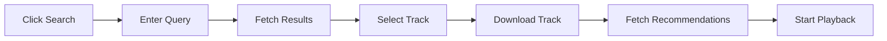

MUDE integrates with YouTube Music to provide seamless music search and playback capabilities directly within your VS Code editor.

## How search works

The music search functionality uses the YouTube Music API to search for songs and videos. When you search for music, MUDE:

1. Searches both songs and videos on YouTube Music
2. Displays results with track name, artist, and duration
3. Downloads the selected track using yt-dlp
4. Automatically fetches recommendations for continuous playback

### Search interface

When you trigger a search, you'll see three options:

<Tabs>
  <Tab title="New search">
    Enter a search query to find music on YouTube Music. Results are filtered to show only songs and videos.

    ```typescript
    // Example search result format
    {
      label: "Song Name",
      detail: "Artist Name - 3:45",
      data: {
        videoId: "abc123",
        name: "Song Name",
        artist: { name: "Artist Name" },
        duration: 225
      }
    }
    ```
  </Tab>
  <Tab title="Recent plays">
    View your recently played tracks and replay them instantly without searching again.
  </Tab>
  <Tab title="Clear history">
    Clear your search history to start fresh.
  </Tab>
</Tabs>

## YouTube Music integration

MUDE uses the `ytmusic-api` package to interact with YouTube Music:

```typescript
import YTMusic from 'ytmusic-api';
const ytmusic = new YTMusic();

// Initialize and search
await ytmusic.initialize();
const songs = await ytmusic.searchSongs(query);
const videos = await ytmusic.searchVideos(query);
```

<Note>
The YouTube Music API is initialized automatically when you perform a search. No authentication is required.
</Note>

## Download process

When you select a track, MUDE downloads it using yt-dlp:

1. **Download location**: Tracks are downloaded to your extension's global storage directory
2. **Format**: Downloads in `bestaudio/best` format for optimal quality
3. **Retry mechanism**: Up to 3 download attempts with exponential backoff
4. **Cleanup**: Previous downloads are automatically removed to save space

```typescript
// Download configuration
await ytDl(url, {
  output: downloadPath,
  format: 'bestaudio/best'
});
```

<Info>
Downloaded tracks are stored temporarily and are replaced when you play a new track.
</Info>

## Platform compatibility

MUDE handles platform-specific differences automatically:

### Windows
- Automatically resolves yt-dlp binary path issues
- Creates `.exe` copy if needed for proper execution
- Provides helpful error messages for binary issues

### Unix/Linux/macOS
- Uses standard yt-dlp binary from package
- No additional configuration needed

<Tip>
If you encounter download issues on Windows, ensure the `youtube-dl-exec` package is properly installed in your extension's node_modules directory.
</Tip>

## Commands

The following commands are available for music search:

| Command | Description | Keybinding |
|---------|-------------|------------|
| `MudePlayer.searchMusic` | Open the music search interface | None (default) |

<Note>
You can assign custom keybindings to the search command through VS Code's keyboard shortcuts settings.
</Note>

## Search flow

Here's what happens when you search for music:



1. Click the search button (🎧 icon) in the status bar
2. Choose "New Search" or "Recent Plays"
3. Enter your search query
4. Select a track from the results
5. MUDE downloads the track and fetches recommendations
6. Playback begins automatically

<Info>
Recommendations are fetched immediately after you select a track, ensuring seamless continuous playback.
</Info>